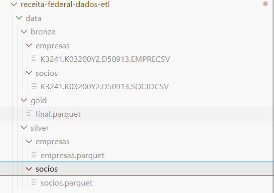
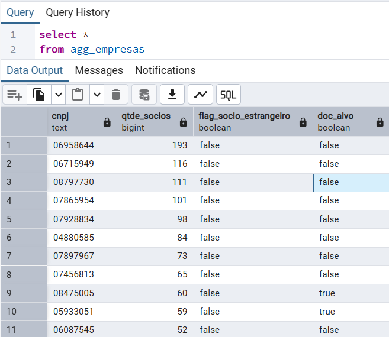

# Receita Federal ETL

Este projeto implementa um pipeline de ingestão e transformação de dados públicos disponibilizados pela Receita Federal sobre **Empresas** e **Sócios**.  

---

## Objetivo do Desafio

- Ingestão de dados públicos (empresas e sócios) a partir de arquivos disponibilizados pela Receita Federal.
- Processamento e padronização dos dados em múltiplas camadas de transformação.
- Geração de uma tabela final com atributos enriquecidos:
  - `cnpj`
  - `qtde_socios`
  - `flag_socio_estrangeiro`
  - `doc_alvo`

---

## Arquitetura em Camadas

O projeto segue a arquitetura em camadas conhecida como **Medallion Architecture**:

### 1. Bronze (Raw Layer)
- **O que é:**  
  Camada de ingestão **bruta** dos dados diretamente do endpoint da Receita Federal (arquivos `.zip`).
- **Objetivo:**  
  Preservar a integridade dos dados originais, sem tratamentos, garantindo reprocessamento se necessário.
- **Exemplo:**  
  Arquivos extraídos em `data/bronze/empresas` e `data/bronze/socios`.

---

### 2. Silver (Curated Layer)
- **O que é:**  
  Camada de **tratamento e padronização**, onde os dados brutos são limpos, colunas são renomeadas, e tipos de dados são ajustados.
- **Objetivo:**  
  Garantir dados estruturados, consistentes e prontos para análises ou integrações.
- **Exemplo de tabelas criadas:**
```sql  
  - `stg_empresas`  
  - `stg_socios`
```
---

### 3. Gold (Business Layer)
- **O que é:**  
  Camada de **modelagem analítica**, onde regras de negócio são aplicadas e métricas/indicadores são criados.
- **Objetivo:**  
  Disponibilizar dados prontos para consumo por aplicações transacionais e analíticas.
- **Exemplo de tabela criada:**  
  - `agg_empresas` com:
    - `cnpj`
    - `qtde_socios`
    - `flag_socio_estrangeiro`
    - `doc_alvo`

---

## Tecnologias Utilizadas

- **Python 3.12**
- **Pandas** para manipulação de dados
- **SQLAlchemy** + **Postgres** para persistência
- **Docker & Docker Compose** para containerização
- **Logging** para rastreabilidade e monitoramento do pipeline

---

## Como Executar

### 1. Clonar o repositório
```bash
git clone https://github.com/ssantosfer/receita-federal-dados-etl.git
cd receita-federal-dados-etl
```

### 2. Configurar variáveis de ambiente
Crie um arquivo .env baseado no exemplo:
``` .env
POSTGRES_USER=etl_user
POSTGRES_PASSWORD=etl_pass
POSTGRES_DB=etl_db
POSTGRES_PORT=5432
POSTGRES_CONN=postgresql+psycopg2://etl_user:etl_pass@db:5432/etl_db
```
### 3. Subir os containers
```bash
docker-compose up --build
```
### 4. Executar o pipeline
O container pipeline já executa automaticamente o main.py.
Ao final, os dados estarão disponíveis nas tabelas:

`stg_empresas`  
`stg_socios`
`agg_empresas`

---

## 🚀 Executando o projeto sem Docker

O processo também pode ser executado **sem a utilização do Docker**.  
Para isso, siga os passos abaixo:

1. Crie um arquivo `.env` na raiz do projeto com a variável de conexão completa:

   ```bash
   POSTGRES_CONN=postgresql+psycopg2://<usuario>:<senha>@localhost:5432/<nome_do_banco>
  ```
Substitua <usuario>, <senha> e <nome_do_banco> pelos valores corretos do seu PostgreSQL local.

2. Execute o pipeline diretamente com Python:
   ```bash
    python main.py
  ```
---

## Estrutura do Projeto
```bash
├── data/               # Dados armazenados em camadas (bronze, silver,gold)
├── extract/            # Scripts de ingestão (download e extração)
├── transform/          # Scripts de tratamento (camada silver)
├── load/               # Scripts de persistência no banco (camada gold)
├── utils/              # Funções utilitárias
├── schema/             # Esquema das tabelas que estão sendo ingeridas
├── main.py             # Orquestração do pipeline
├── requirements.txt    # Dependências do projeto
├── Dockerfile
├── docker-compose.yml
└── README.md
```
### Dados Locais

Os arquivos de dados (bronze, silver, gold) não são versionados no GitHub para manter o repositório leve, devido ao volume de dados.
Eles são ignorados via .gitignore.
Ao rodar o pipeline (main.py), os dados são automaticamente baixados e processados nas respectivas camadas.



---

## Output Final

Tabela `agg_empresas`:

| Coluna                   | Tipo    | Descrição                                                                 |
| ------------------------ | ------- | ------------------------------------------------------------------------- |
| `cnpj`                   | string  | Número de inscrição no CNPJ                                               |
| `qtde_socios`            | int     | Número total de sócios participantes                                      |
| `flag_socio_estrangeiro` | boolean | True se existe pelo menos 1 sócio estrangeiro                             |
| `doc_alvo`               | boolean | True se porte da empresa = 03 **e** possui mais de 1 sócio; caso contrário, False |

